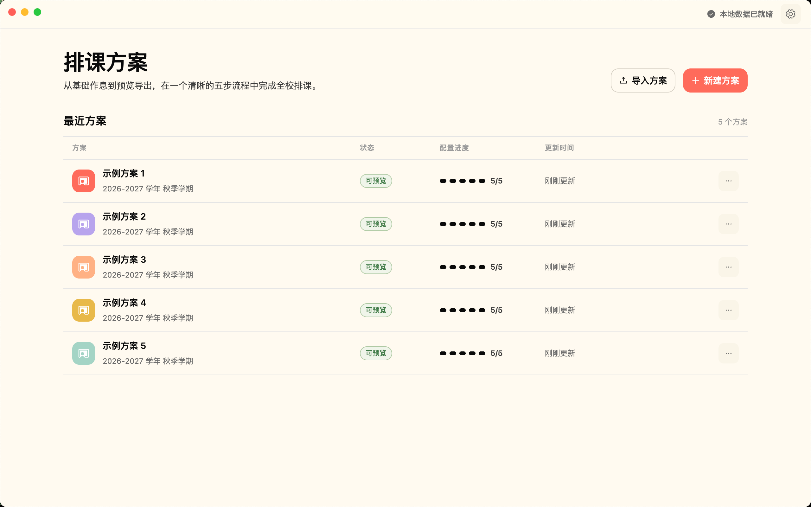
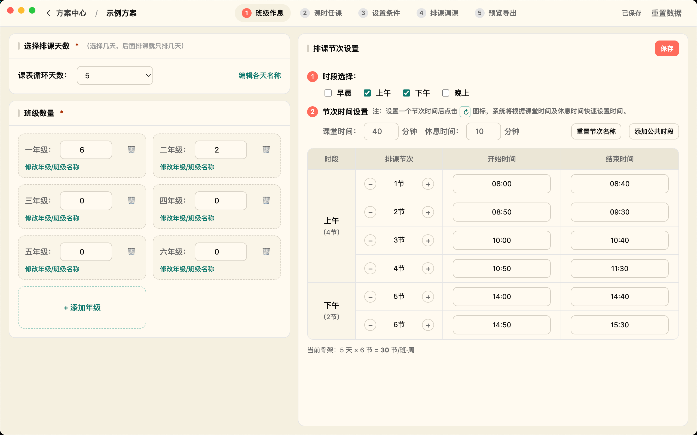
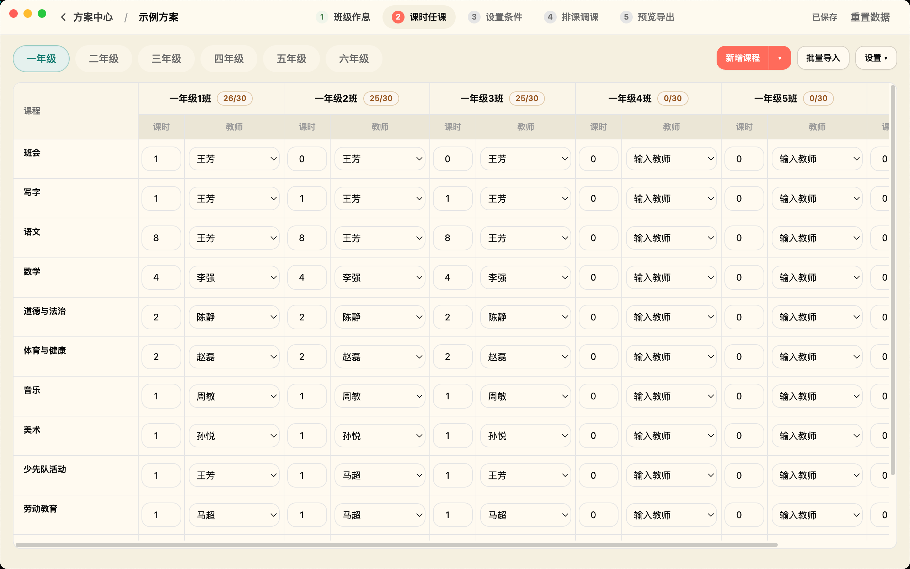
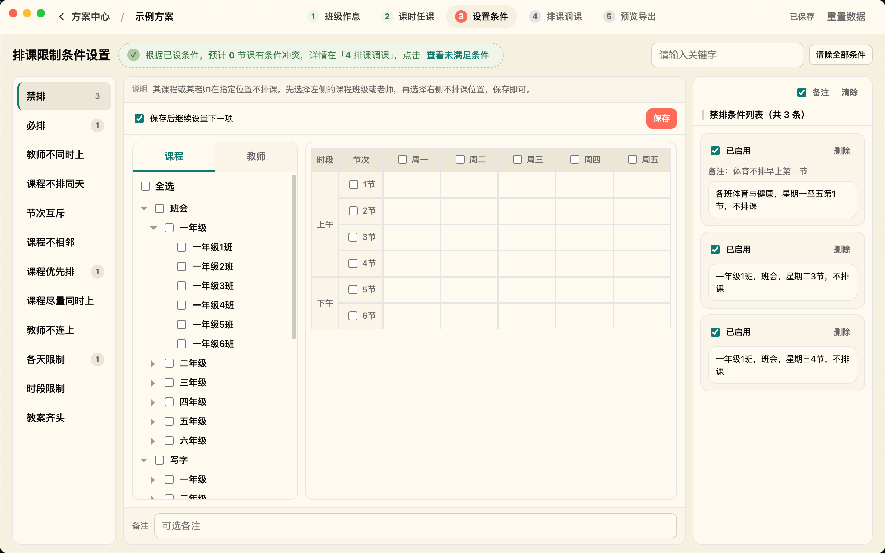
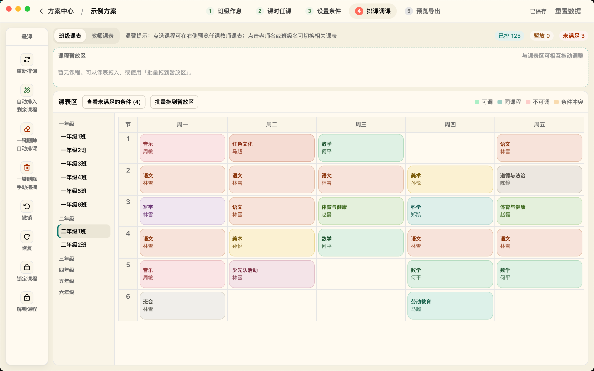
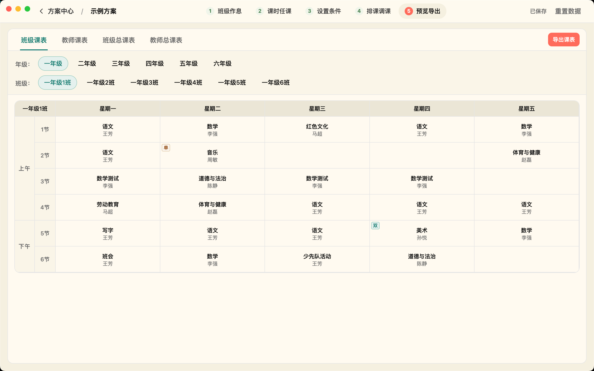

# ClassOwl

**面向小学教务的离线排课桌面应用。** 从班级作息到课表导出，五步走完整个排课流程；数据全部保存在本机，不联网。

[](https://github.com/Hariketsu/ClassOwl/actions/workflows/build.yml)
[](LICENSE)

| 方案中心 | 1 班级作息 |
|---|---|
|  |  |
| **2 课时任课** | **3 设置条件** |
|  |  |
| **4 排课调课** | **5 预览导出** |
|  |  |

## 特性

- **五步排课流程**：班级作息 → 课时任课 → 设置条件 → 排课调课 → 预览导出
- **CP-SAT 自动排课**：OR-Tools 约束求解，支持禁排/必排/教师不同时上等 12 类排课条件；无解时给出具体原因
- **手动微调**：拖拽调课、课程锁定、暂放区，撤销/恢复由后端持久化，刷新重启都不丢
- **多方案管理**：方案中心新建/复制/重命名/删除，支持从已有方案分三级导入（只带作息 / 加课时任课 / 加排课条件）
- **导出**：班级/教师课表、总课表，Excel / PDF / PNG 三种格式
- **完全离线**：本地 SQLite 存储，后端只监听 `127.0.0.1`，附开箱即用的示例方案

## 下载安装

### macOS（Apple Silicon）

从 [Releases](https://github.com/Hariketsu/ClassOwl/releases) 下载 `ClassOwl-*-arm64.dmg`，打开后把 `ClassOwl.app` 拖入「应用程序」。

> 当前为 ad-hoc 签名，首次打开会被 Gatekeeper 拦截：右键 App →「打开」→「打开」即可；或在终端执行
> `xattr -dr com.apple.quarantine /Applications/ClassOwl.app`。

### Windows

从 [Releases](https://github.com/Hariketsu/ClassOwl/releases) 下载 NSIS 安装包（`*.exe`）或便携 zip。

## 从源码运行

环境：Python 3.12（建议用 [uv](https://docs.astral.sh/uv/)）、Node.js 22+。

```bash
uv sync
npm ci
npm --prefix frontend ci
```

开发模式（前端热更新，两个终端）：

```bash
npm --prefix frontend run dev    # 终端 1：Vite dev server
npm run dev:app                  # 终端 2：Electron + Python sidecar（走 uv run，不用先打包）
```

## 测试

```bash
.venv/bin/python -m pytest -q          # 后端 105 项
npm --prefix frontend run test         # 前端 72 项（vitest）
npm --prefix frontend run test:e2e     # 端到端 9 项（真实 Electron，先执行下面的 build）
```

e2e 测的是构建产物，跑前先 build：

```bash
npm --prefix frontend run build && npm run build:electron
```

e2e 用 Playwright 的 `_electron.launch()` 启动真实应用，覆盖真 preload、真令牌握手、真 SQLite。每个测试用独立临时数据目录。

## 构建打包

| 命令 | 产出 |
|---|---|
| `npm --prefix frontend run build` | `frontend/dist` |
| `npm run build:electron` | `electron/dist` |
| `npm run build:sidecar` | `build/sidecar-dist/classowl` |
| `npm run dist:mac` | `dist/mac-arm64/ClassOwl.app` + dmg |

Windows 安装包（NSIS `*.exe` / 便携 zip）在 Windows 上同样用 `npx electron-builder --win nsis zip` 构建；各平台安装包统一从 [Releases](https://github.com/Hariketsu/ClassOwl/releases) 获取。

## 技术栈与架构

- **界面**：Electron + React + TypeScript
- **后端**：Python sidecar（FastAPI + SQLite + OR-Tools CP-SAT），随应用启动，只监听 `127.0.0.1` 随机端口，带启动令牌
- **数据**：SQLite（WAL），文档带 `schema_version` 迁移链；保存用 `baseRev` 乐观并发；撤销/恢复持久化（限 50 条）
- **安全**：令牌不出现在进程命令行；Renderer 开 `contextIsolation` + `sandbox`，关 `nodeIntegration`，严格 CSP

数据与日志位置（macOS）：

```
~/Library/Application Support/classowl/data/classowl.db
~/Library/Application Support/classowl/data/logs/backend.log
```

## 文档

| 文件 | 内容 |
|---|---|
| `docs/design/design-system.md` | **视觉权威**：色彩角色、选中态、控件规格 |
| `docs/product/domain-glossary.md` | 领域词汇表 |

## License

[Apache-2.0](LICENSE) · 第三方组件归属见 [NOTICE](NOTICE)
